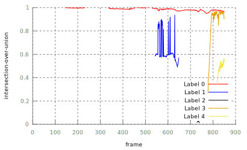
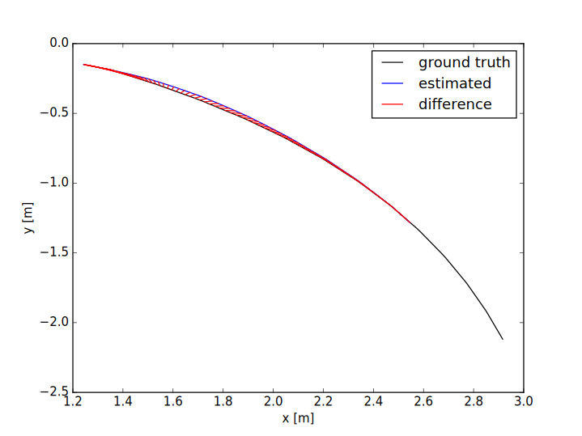
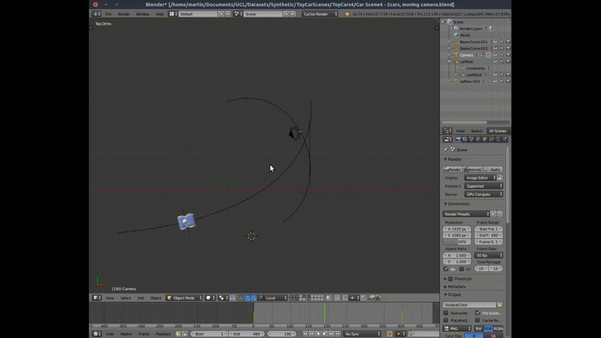
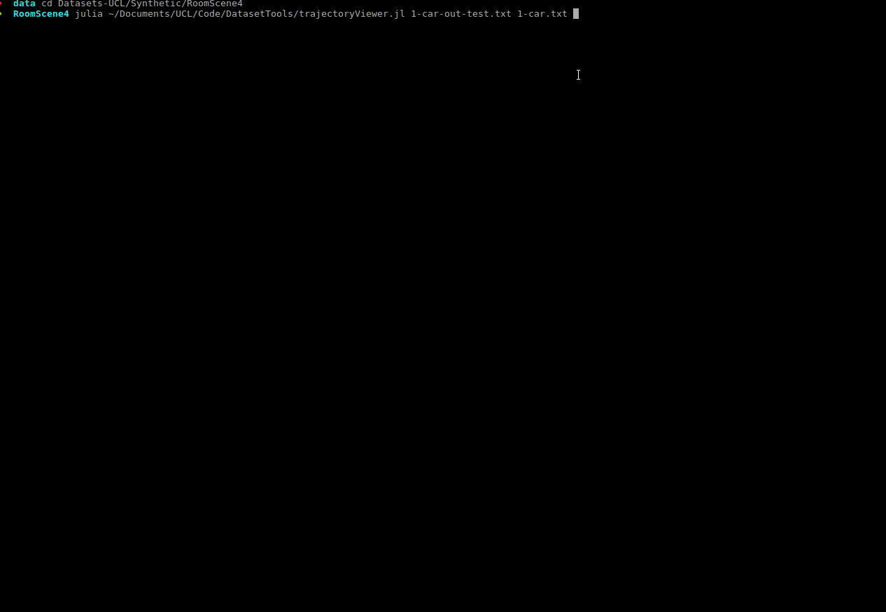
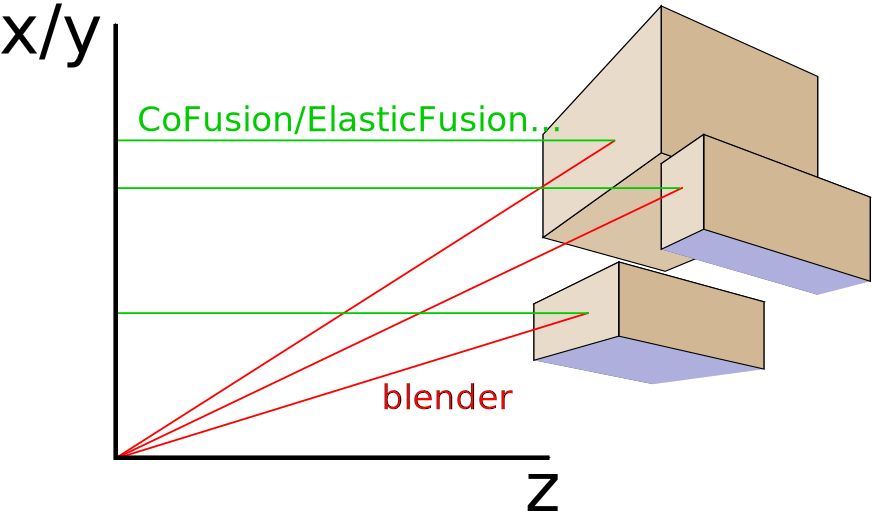

# Installation

   ## Requirements

   * opencv
   * glm for trajectory_tool

    `sudo apt-get install libglm-dev`
    `sudo apt-get install gtk2-engines-pixbuf gnome-themes-standard`

   ## Example

    git clone git@github.com:martinruenz/dataset-tools.git
    cd dataset-tools
    mkdir Release
    cd Release
    cmake .. && make -j8

    # Optionally add to path (assumed in some steps below)
    #   Log out and in again afterwards!
    echo "PATH=\$PATH:`pwd`" >> ~/.profile

# HowTos

  * **How to evaluate your object-aware SLAM-method completely automatically?** (Analyse segmentation and trajectory quality)

    The script `automatisation/cofusion.jl` was written for this purpose and evaluates the object-segmentation and trajectory quality of your method.
    It assumes that you have the following data available:

      * ground-truth segmentation
      * exported segmentation
      * ground-truth trajectories (file-name has to contain corresponding label-id)
      * exported trajectories

     
    Example using Co-Fusion:

        CoFusion \
          -basedir /path/to/CarScene4/ \
          -dir colour \
          -depthdir depth \
          -cal calibration.txt \
          -exportdir /path/to/export \
          -segMinNew 0.008 \
          -crfSmooth 1 \
          -crfPos 0.51 \
          -es -ep -run -q -keep
        ./cofusion.jl \
          --gt-poses /path/to/CarScene4/trajectories \
          --ex-poses /path/to/export \
          --gt-masks /path/to/CarScene4/masks_id \
          --ex-masks /path/to/export \
          --out /path/to/output

    The script automatically tries to perform the steps of the following _HowTo_ by converting the trajectories using the frame with the best intersection-over-union score.

    As a result you will get an intersection-over-union graph, see the following image, as well as a trajectory plot, as in the image of the next _HowTo_.

    

  * **How to compare an object-trajectory of your non-static SLAM-method with ground-truth data?**

    Since your SLAM-method is not aware of the ground-truth coordinate system (the origin) of the given object (your system has to pick a "random" origin), an alignment method has to be used before a meaningful evaluation is possible. Luckily, your system should already align moving objects to the camera, so if you pick a frame which aligns camera and object nicely, it can be used to compute the ground-truth object origin in the reference frame of your object. Subsequently, your and the ground-truth origin coincide and evaluation algorithms can be applied.

    This is how it is done:
    + Export the object poses produced by your system in this format (t = frame):
          t x y z qx qy qz qw  
    + Export the ground-truth poses from blender (see *io_export_pose.py*)
    + Run *convert_poses* to map the obejct-origin, like:
          convert_poses \
            --frame <good-frame-number> \
            --object <your-poses.txt> --camera <your-camera-poses.txt> \
            --gtobject <gt-poses.txt> --gtcamera <gt-cam-poses.txt> \
            --out <mapped-origin.txt>
    + Run an evaluation script. Such as *evaluate_ate.py* by TUM:
          wget https://svncvpr.in.tum.de/cvpr-ros-pkg/trunk/rgbd_benchmark/rgbd_benchmark_tools/src/rgbd_benchmark_tools/evaluate_ate.py
          wget https://svncvpr.in.tum.de/cvpr-ros-pkg/trunk/rgbd_benchmark/rgbd_benchmark_tools/src/rgbd_benchmark_tools/associate.py
          python evaluate_ate.py --verbose --plot <your-plot.pdf> <your-poses.txt> <mapped-origin.txt>

    The result should look something like this:
    

    * **How to create a (SLAM-)dataset using Blender?**

     _!! TODO !!_ example blender file, export depth, export segmentation, reference to export poses & calibration

     ... convert depth, *convert_depth* described below ...

          convert_depth \
            --dir depth_original \
            --outdir depth_converted \
            -cx 320 \
            -cy 240 \
            -fx 360 \
            -fy 480 \
            -z

     Also if convert colour-masks to ID-masks

          cp -r maskdir id_masks
          label_finder \
            --dir id_masks \
            --outdir id_masks \
            --prefix Mask \
            --width 4 \
            --starti 1 \
            -c 255,0,0 -r 1,1,1
          # repeat calling label_finder for different colours (-c)
          # and different IDs (-r, where the parameter is id,id,id)

# Tools

  ## Scripts

  ### Blender

  └── **io_export_pose.py**  

  Blender addon-script that enables the export of object and camera poses. The exported format is either:

      t x y z qx qy qz qw  
  or

      t x y z rx ry rz  

  

  └── **get_calibration.py**

  Script to export intrinsic pinhole-camera parameters from blender.
  [Written by the user rfabbri of http://blender.stackexchange.com](http://blender.stackexchange.com/questions/15102/what-is-blenders-camera-projection-matrix-model/38189).

  **trajectoryViewer.jl**

  Simple Julia-script that visualises a list of trajectories in the format:

      t x y z qx qy qz qw  
  

  ## C++ Tools

  **convert_depth** *[Blender]*

  When extracting depth-maps from blender, the depth values are usually not projective and hence, have to be converted to be used common scenarios.
  This tool can perform the necessary conversion. It is also able to add noise to depth values.

    Input: Depth-map(s) (exr files), + optional parameters
    Output: Depth-map(s) (exr files)

  

  **convert_exrToRGB**

  Convert exr to RGB image file, usually for visualisation. The floating point input is mapped from 'min-max' to '0-255'.

  **convert_klgToPly**

  Allows you to extract colour images, depth images and PLY-point clouds from each each frame of a .klg file.

  **convert_masks**

  Convert colour mask images (CV_8UC3) to ID mask images (CV_8UC1). The tool ensures that the re-mapping is consistent throughout a dataset.

  **convert_poses**

  Convert the ground-truth origin of an object to world-coordinate poses in your export -- for each frame. *(See HowTos)*

  **KlgViewer**

  View a \*.klg file (depth+rgb) like a video

  **label_associator**

  Assume you have two subsequent frames with object labels but incoherent label colors. This tool tries to correctly associate labels, in order to make them coherent.

  **label_finder**

  Highlight a color in a dataset like CamVid, also allows you to replace that colour.
  

  **label_merger**

  Merge labels with certain amount of neighbours.

# License

  More information regarding licensing can be found in LICENCES.txt
