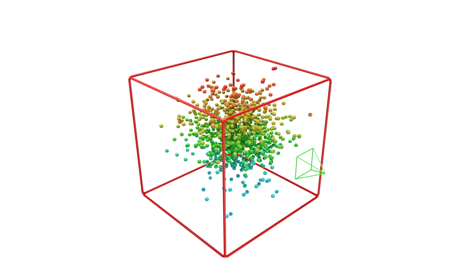
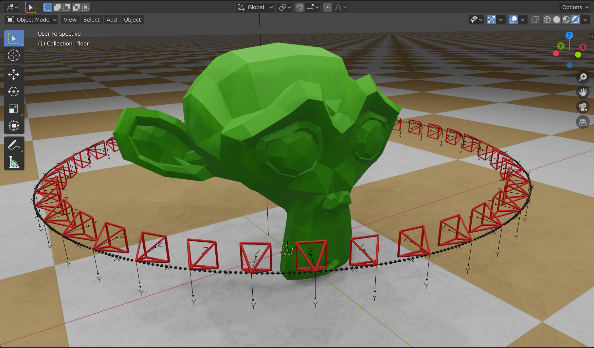

# Functionality

* Visualization utilities
    - Add / animate camera frustrums
    - Add camera trajectories
    - Animate meshes (reconstruction output) over time
    - Import pointclouds
    - Import surfels
    - Import meshes
    - Heatmap material
    
* Data generation utilities
    - Simulate 2D features
    - Import / export pinhole camera parameters
    - Export camera and object trajectories
    - Render depth-maps
    - Render object masks
    - Render normal maps

# Organization and Examples

This section provides examples and explains which functionality is provided in different python files. It is assumed
that the toolkit was imported, see [section workflow](#Workflow).

## `datasets.py`
* Functionality for working with existing datasets
* Example:

## `scene.py`
* Functionality for manipulating scenes, such as adding pointclouds, cameras, trajectories, bounding boxes, etc.
* Example:
```python
# Visualize pointcloud (material: heightmap) with bounding-box (material: red)
cloud = utils_scene.add_pointcloud(np.random.randn(500, 3), radius=0.1, material=utils_material.get_material_heightmap())
box = utils_scene.add_axis_aligned_bb_to_object(cloud, border_radius=0.1, material='red')
```
* Output:




* Example:
```python
# Generate example trajectory (circle)
times = np.linspace(0, 2 * np.pi, 500, endpoint=False)
transforms_wc = [utils_common.matrix_from_lookat((2*np.sin(t), 2*np.cos(t), 1), (0,0,1)) for t in times]

# Add objects
utils_scene.add_trajectory(transforms_wc, frustum_radius=0.03, frustum_scale=0.15,min_distance_cameras=0.3)
utils_scene.add_floor(color0=(0.647, 0.408, 0.165,1))
bpy.ops.mesh.primitive_monkey_add(size=2, enter_editmode=False, location=(0, 0, 1))

```

* Output:



## `material.py`
* Functionality for using materials
* Example:

```python
import sys, numpy as np 
sys.path.append('/home/martin/devel/dataset-tools-private/blender')
import utils_scene, utils_mesh, utils_material

points =  np.random.randn(500, 3)
cloud = utils_scene.add_pointcloud(points, radius=0.1, material=utils_material.get_material_heightmap())
```

* Output:


# Workflow

From within blender I usually import the modules like this (there are different workflows though, you don't even need to
open the GUI for rendering):
* Open `scripting` view / text editor (`Shift + F11`) and create new text document that is part of the .blend file
* Import this toolkit by adding (usage of `reload` ensures changes are applied):
```python
import sys
sys.path.append('<path/to/this/toolkit>')
import utils_mesh, utils_scene, utils_common
from importlib import reload  
utils_scene, utils_mesh, utils_common = reload(utils_scene), reload(utils_mesh), reload(utils_common)
```
* Add your code and run script in blender with `Alt+P`

If you don't plan to make changes to the toolkit, for example to run the examples, you can leave the reload part:
```python
import sys, numpy as np
sys.path.append('<path/to/this/toolkit>')
import utils_mesh, utils_scene, utils_common
```